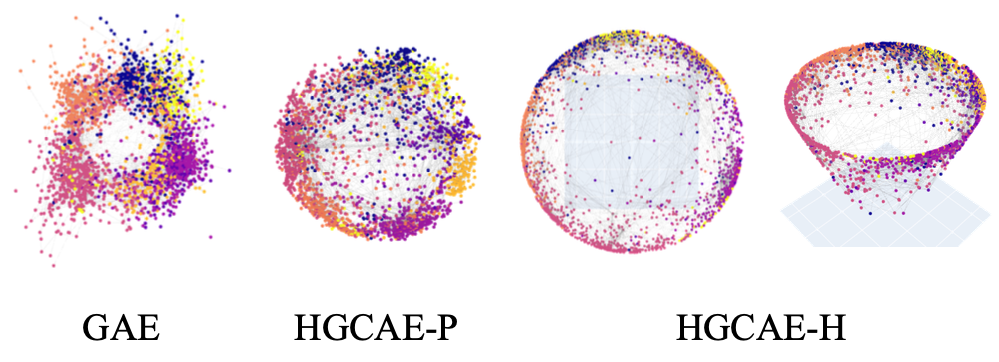
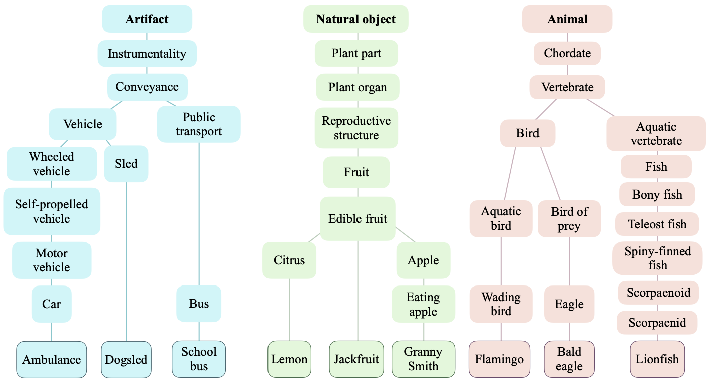

Hyperbolic Graph Convolutional Auto-Encoders 
==================================================

**Accepted to **CVPR2021** :tada:**


Official PyTorch code of [**Unsupervised Hyperbolic Representation Learning via Message Passing Auto-Encoders**]()

**[Jiwoong Park](https://jiwoongpark92.github.io)&ast;, 
[Junho Cho](http://tmmse.xyz/junhocho/)&ast;, Hyung Jin Chang, Jin Young Choi** <sub>(\* indicates equal contribution)</sub>


<sub>Embeddings of cora dataset. [GAE](https://github.com/tkipf/gae) is Graph Auto-Encoders in Euclidean space, HGCAE is our method. P is Poincare ball, H is Hyperboloid.</sub>


## Overview

This repository provides `HGCAE` code in PyTorch for reproducibility with

- `PoincareBall` manifold 
- Link prediction task and node clustering task on graph data
	- 6  datasets: `Cora, Citeseer, Wiki, Pubmed, Blog Catalog, Amazon Photo`
	- `Amazon Photo` was downloaded via `torch-geometric` package.
- Image clustering task on images
	- 2 datasets: `ImageNet10, ImageNetDog`
	- Image features extracted from `ImageNet10, ImageNetDog` with [PICA](https://github.com/Raymond-sci/PICA) image clustering algorithm
	- `Mutual K-NN` graph from the image features provided.
- `ImageNet-BNCR`
  - We have constructed a new dataset, `ImageNet-BNCR`(Balanced Number of Classes across Roots), via randomly choosing 3 leaf classes per root. We chose three roots, Artifacts, Natural objects, and Animal. Thus, there exist 9 leaf classes, and each leaf class contains 1,300 images in `ImageNet-BNCR` dataset.
  - 


## Installation  Guide

We use docker to reproduce performance. Please refer [guide.md](guide.md)


## Usage

### 1. Run docker

Before training, run our docker image:

```docker run --gpus all -it --rm --shm-size 100G -v $PWD:/workspace  junhocho/hyperbolicgraphnn:8 bash```

If you want to cache edge splits for train/val dataset and load faster afterwards, `mkdir ~/tmp` and run:

```docker run --gpus all -it --rm --shm-size 100G -v $PWD:/workspace -v ~/tmp:/root/tmp junhocho/hyperbolicgraphnn:8 bash```


### 2.  ```train_<dataset>.sh```

In the docker session, run each train shell script for each dataset to reproduce performance:

#### Graph data link prediction

Run following commands to reproduce results:

- `sh script/train_cora_lp.sh`
- `sh script/train_citeseer_lp.sh`
- `sh script/train_wiki_lp.sh`
- `sh script/train_pubmed_lp.sh`
- `sh script/train_blogcatalog_lp.sh`
- `sh script/train_amazonphoto_lp.sh`

|              | ROC          | AP           |
|--------------|--------------|--------------|
| Cora         | 0.94890703   | 0.94726805   |
| Citeseer     | 0.96059407   | 0.96305937   |
| Wiki         | 0.95510805 | 0.96200790 |
| Pubmed       | 0.96207212 | 0.96083080 |
| Blog Catalog | 0.89683939 | 0.88651569 |
| Amazon Photo | 0.98240673 | 0.97655753 |


#### Graph data node clustering

- `sh script/train_cora_nc.sh`
- `sh script/train_citeseer_nc.sh`
- `sh script/train_wiki_nc.sh`
- `sh script/train_pubmed_nc.sh`
- `sh script/train_blogcatalog_nc.sh`
- `sh script/train_amazonphoto_nc.sh`

|             | ACC        | NMI        | ARI        |
|-------------|------------|------------|------------|
| Cora		  | 0.74667651 | 0.57252940	| 0.55212928 |
| Citeseer	  | 0.69311692 | 0.42249294	| 0.44101404 |
| Wiki		  | 0.45945946 | 0.46777881 | 0.21517031 |
| Pubmed	  | 0.74849115 | 0.37759262 | 0.40770875 |
| Blog Catalog| 0.55061586 | 0.32557388 | 0.25227964 |
| Amazon Photo| 0.78130719 | 0.69623651 | 0.60342107 |

#### Image clustering

- `sh script/train_ImageNet10.sh`
- `sh script/train_ImageNetDog.sh`

|             | ACC        | NMI        | ARI        |
|-------------|------------|------------|------------|
| ImageNet10  | 0.85592308 | 0.79019131 | 0.74181220 |
| ImageNetDog | 0.38738462 | 0.36059650 | 0.22696503 |


- At least 11GB VRAM is required to run on Pubmed, BlogCatalog, Amazon Photo.
- We have used GTX 1080ti only in our experiments.
- Other gpu architectures may not reproduce above performance.

#### Parameter description

- `dataset` : Choose dataset. Refer to each training scripts.
- `c` : Curvature of hypebolic space. Should be `>0`. Preferably choose from `0.1, 0.5 ,1 ,2`.
- `c_trainable` : 0 or 1. Train `c` if 1.
- `dropout` : Dropout ratio.
- `weight_decay` : Weight decay.
- `hidden_dim` : Hidden layer dimension. Same dimension used in encoder and decoder.
- `dim` : Embedding dimension.
- `lambda_rec` : Input reconstruction loss weight.
- `act` : `relu, elu, tanh`.
- `--manifold PoincareBall` : Use `Euclidean` if training euclidean models.
- `--node-cluster 1` : If specified perform node clustering task. If not, link prediction task.


## Acknowledgments

This repo is inspired by [hgcn](https://github.com/HazyResearch/hgcn).

And some of the code was forked from the following repositories:

 * [pygcn](https://github.com/tkipf/pygcn/tree/master/pygcn)
 * [gae](https://github.com/tkipf/gae/tree/master/gae)
 * [hyperbolic-image-embeddings](https://github.com/KhrulkovV/hyperbolic-image-embeddings)
 * [pyGAT](https://github.com/Diego999/pyGAT)
 * [poincare-embeddings](https://github.com/facebookresearch/poincare-embeddings)
 * [geoopt](https://github.com/geoopt/geoopt)


## License

This work is licensed under the MIT License

## Citation


```
@article{park2021hgcae,
title={Unsupervised Hyperbolic Representation Learning via Message Passing Auto-Encoders},
author={Park, Jiwoong and Cho, Junho and Chang, Hyung Jin and Choi, Jin Young},
year={2021},
journal={arXiv preprint arXiv:XXXXX},
}
```
